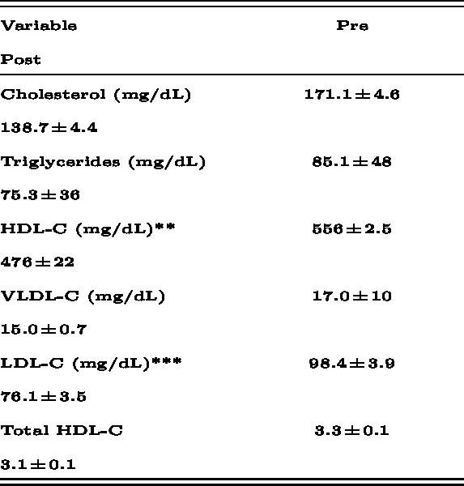
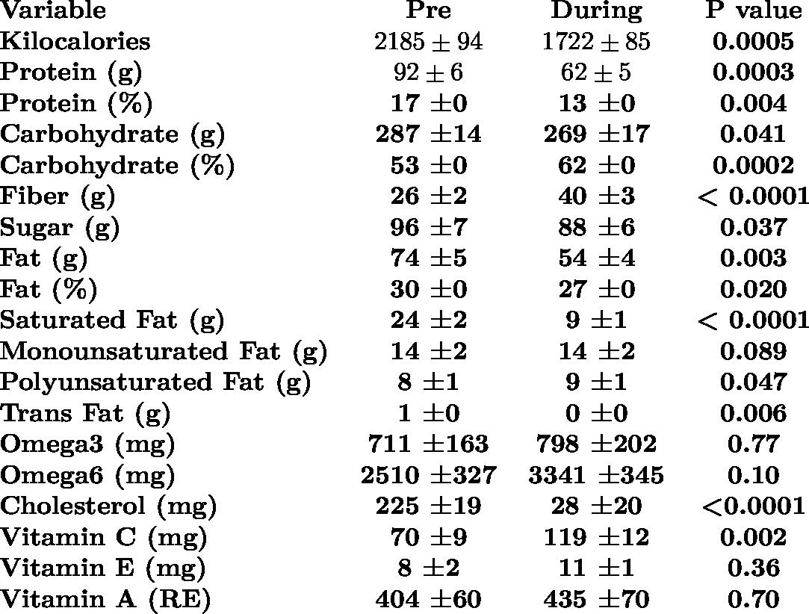

# BlomertlipidsiHethndDiseas2010994
BlomertlpidsiHethndDiseas2010994
http://www.ipidworld.com/content/9/1/94

## Table 4: Lipid panel data of men and women before and after a 21-day Daniel Fast

Values are mean ± SEM.
- P<0.0001
- p=0.02
- p=0.0004
- No other statistically significant differences noted (p>0.05)

Reasons the Daniel Fast may be beneficial include:
1. Reducing blood pressure.
2. Significantly reducing total, LDL, and HDL cholesterol.
3. Reducing insulin, HOMA-IR, and C-reactive protein in a clinically meaningful, although statistically insignificant manner.
4. Not causing any negative effects on blood count or metabolic panel values.
5. Being well-tolerated.
6. Possibly being useful as a nutrition education tool for both men and women.

To our knowledge, this is the first scientific investigation of the Daniel Fast. Subsequent statistical analyses indicated no interactions between normal weight and overweight/obese subjects, men and women, and exercise-trained and untrained subjects. This suggests that a wide variety of individuals may benefit from a dietary approach in accordance with the Daniel Fast. As we were not concerned with weight status, sex, or training status comparisons in this initial study, coupled with the fact that no interactions were noted for any of the above-mentioned comparisons, only pooled data are presented in the tables and discussed within this manuscript.

It is important to note that our findings are in reference to relatively healthy, young to middle-aged men and women (age range: 20-62 years), with a wide BMI range (18.0 kg/m² to 40.6 kg/m²), and varied regular exercise and dietary habits. Interestingly, we noted similar findings in all subject groups. For example, similar percent changes in all measured variables from pre to post-fast were observed in subjects who are of normal weight and low body fat (e.g., <10% for men and <20% for women), who exercise regularly for 4+ hours per week and eat a very "clean" diet on a regular basis (including vegetarians), as compared to overweight/obese, sedentary subjects who consume a relatively poor diet.

However, it should be noted that while the percent change in outcome measures was similar between such individuals, the absolute values were better for the normal weight, exercise enthusiasts compared to the overweight/obese, sedentary subjects. Based on our collective findings, it is possible that individuals with diagnosed metabolic and cardiovascular disorders may experience clinically meaningful results on such a dietary regimen. Future work should consider the inclusion of such patients, as this diet may be considered an anti-inflammatory, anti-atherogenic, anti-hypertensive, non-pharmacologic approach to disease risk management.

## Table 5: Dietary data of men and women before and during the final seven days of a 21-day Daniel Fast

While we did note a reduction of blood pressure, as well as a decrease in total (19%) and LDL cholesterol (23%) with the Daniel Fast in just three weeks, findings similar to those noted for other plant-based diets, we also noted a decrease in HDL-C (14%). While the total: HDL-C was improved slightly, the drop in HDL-C remains a concern. If this eating plan is to be viewed as "heart healthy" in all aspects, future studies involving the Daniel Fast may include specific food choices (e.g., almonds, plantago ovata husks, walnuts) and/or dietary supplements noted to increase HDL-C, in an effort to maintain HDL-C while decreasing both total and LDL-C.

Aside from HDL-C, although insulin (24%), HOMA-IR (26%), and C-reactive protein (49%) decreased during the 21-day fast, these decreases failed to reach statistical significance. A post hoc power analysis indicated that a total of 57 subjects would be needed to demonstrate statistical significance for insulin and HOMA-IR, while 65 subjects would be needed for C-reactive protein. Future studies may include a larger sample size in order to improve the chance of achieving statistical significance for these variables.