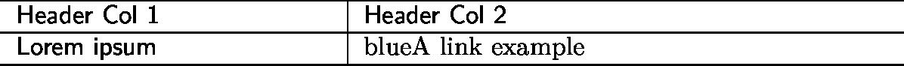
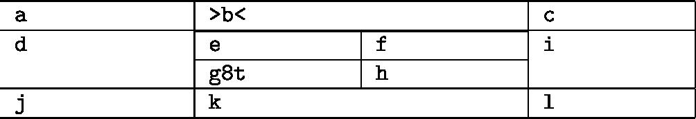
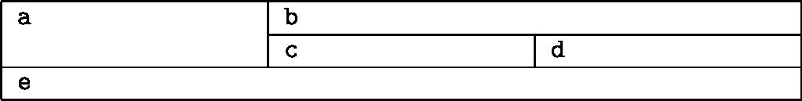

# Simple Uniform Table

# Nested Table

# Table with Merged Cells

# Budget

The budget for the current school year was distributed by Richard Miller, PTA Treasurer, and reviewed by the board and PTA members at the last meeting. In tonight's meeting, Steve Watson made a motion to approve the budget which was seconded by Harry Anderson. All presents voted in favor of approving the budget as presented.

# Principal's Report

Principal Samuel Pattison presented his report.

# New Business

- Recap of Back to School night - May 9
- Parent Education Programs - Counselors
- Teacher Grants Application Process - [School Name]

# Committee Reports

- Membership
- Volunteers
- Newsletter
- Computer Support